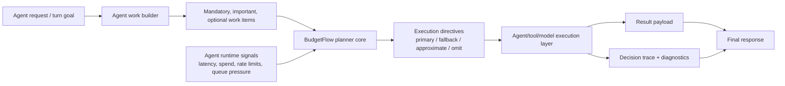

# BudgetFlow agent orchestration extension proposal

This document proposes how BudgetFlow could evolve from request-scoped adaptive orchestration for service workloads into adaptive orchestration for agent systems operating under latency and budget pressure.

It is intentionally architecture-first. The goal is to define a credible path forward without prematurely building a full agent framework.

## Why this direction fits BudgetFlow

BudgetFlow's current core already models several of the hard parts of agent orchestration:

- grouped planning across related work
- mandatory vs important vs optional work
- explicit degraded execution paths
- runtime pressure inputs that are distinct from the request budget
- decision trace and request-level diagnostics
- deterministic, policy-driven degradation instead of ad hoc timeout behavior

That makes agent orchestration a natural extension of the existing model rather than a separate product idea.

## Positioning

BudgetFlow should be understood as:

- **today:** a reusable adaptive orchestration framework with a Spring Boot implementation and a fintech reference workload
- **next:** a framework that can also coordinate agent, tool, and subtask work under the same budget-aware and explainable planning model

The fintech demo remains useful because it proves the reusable orchestration concepts on a concrete workload. An agent extension should follow the same pattern: one narrow, reviewable reference workflow rather than a broad framework rewrite.

## Motivating use cases

### 1) Response-time-bound assistant flows
A support or operations assistant may need to retrieve context, call tools, verify outputs, and format a response inside a strict turn budget.

### 2) Budget-constrained research or analysis workflows
A multi-step workflow may have a spending cap as well as a latency cap, requiring the orchestrator to decide when to use a premium model, a cheaper model, cached context, or a reduced-depth analysis.

### 3) Tool-heavy copilots
An agent may have optional enrichment steps such as additional searches, reranking, or summarization that improve output quality but are not always required for a useful response.

### 4) Compliance-sensitive automation
Some checks must always run before the system can act, while secondary explanations, alternative plans, or polish steps can degrade or be omitted.

## Mapping current BudgetFlow concepts to agent systems

| Current BudgetFlow concept | Agent-system equivalent |
|---|---|
| `AdaptiveRequest` | one agent turn / orchestration run |
| `TaskSpec<T>` | one agent work item: tool call, model invocation, retrieval step, validator, or subtask |
| `TaskKey<T>` | stable identifier for a step or sub-result |
| `Importance.MANDATORY` | work that must complete before returning or acting |
| `Importance.IMPORTANT` | work that strongly improves reliability or usefulness but can degrade |
| `Importance.OPTIONAL` | enrichment, branch exploration, or polish that can degrade or be omitted |
| fallback supplier | cheaper model, cached answer, smaller tool query, or narrower workflow |
| approximate supplier | partial summary, lower-fidelity reasoning, heuristic answer, or shallower search |
| `OMIT` | skip discretionary branch entirely |
| `ExecutionBudget` | turn latency budget and/or orchestration deadline |
| `SystemPressureProvider` | runtime signals such as model latency, tool queue depth, rate limits, spend pressure, or failure rate |
| `DecisionTraceEntry` | explanation for why a step ran normally, degraded, or was skipped |
| `ExecutionLifecycleListener` | hooks for recording prompts, tool timing, model choice, retries, and tracing metadata |

## Proposed architecture direction

### Keep the current core as the planning engine
The existing planner, request budget model, execution modes, diagnostics, and decision trace should remain the center of the system.

The extension should add an agent-oriented layer above the current task model rather than replacing it.

### Add a minimal agent work descriptor layer
The first minimal foothold now exists as `AgentWorkSpec<T>` in `budgetflow-core`: a thin descriptor that maps directly to `TaskSpec<T>` and reuses the existing planner/executor semantics.

Possible extension points:

- `AgentWorkSpec<T>` wrapper around `TaskSpec<T>` (initially implemented as a vocabulary adapter)
- `AgentExecutionPath` metadata for primary/fallback/approximate options
- `AgentRuntimeSignals` adapter that feeds model/tool/runtime pressure into the existing pressure abstraction
- `AgentDecisionMetadata` for agent/tool-specific trace fields layered on top of the current decision trace

The important constraint is that this layer should compile down to the existing planning primitives instead of creating a second planner.

### Start with a flat orchestration model
Phase 2 should assume a single orchestration run made up of related work items planned together.

That means:

- no open-ended agent society model
- no dynamic planner-of-planners architecture
- no commitment yet to arbitrary recursive sub-agent spawning

A flat model is enough to prove the semantics for mandatory work, degraded paths, runtime pressure, and explainability.

## Mandatory vs optional agent work

BudgetFlow's importance model already gives a practical structure for agent systems.

### Mandatory work
Examples:

- required context retrieval needed for correctness
- policy or safety checks before taking an action
- final response assembly required by the caller contract
- execution confirmation for state-changing tool calls

Mandatory work should still behave like current mandatory tasks: preserved first and only omitted in failure scenarios outside normal degradation semantics.

### Important work
Examples:

- secondary verification
- citation collection
- conflict resolution between retrieved sources
- preferred but replaceable tool path

Important work may degrade to a cheaper path when the primary path no longer fits.

### Optional work
Examples:

- additional search rounds
- broader branch exploration
- style improvement or narrative polish
- extra recommendations or alternative plans
- secondary analysis panels in an agent UI

Optional work should be the primary surface for graceful degradation under pressure.

## Planning under latency and budget pressure

Agent orchestration needs to reason about more than wall-clock time, but it should reuse the same planning shape:

1. establish a run budget
2. build all known work items together
3. estimate the cost of primary and degraded paths
4. read runtime pressure signals
5. choose execution modes per item
6. execute with tracing
7. return both result payload and orchestration metadata

### Budget dimensions
The first implementation should keep one primary request budget while allowing pressure signals to represent other constraints.

Examples:

- latency deadline for the current turn
- model spend pressure for the current session or tenant
- tool rate-limit pressure
- backlog or queue pressure in shared execution infrastructure

This keeps the core budget model simple while still letting planner policy react to multi-dimensional pressure.

### Path-aware planning for agents
Path-aware planning becomes even more valuable for agents because degraded paths are often meaningfully cheaper.

Examples:

- premium model -> cheaper model
- broad retrieval -> narrower retrieval
- deep tool workflow -> cached answer
- full critique loop -> single-pass output
- multi-branch reasoning -> single best-path attempt

The planner should continue to budget against the selected path, not the original primary path.

## Graceful degradation strategies

BudgetFlow's existing execution modes map well to agent-specific degradation strategies.

### Execute normally
Use the preferred model/tool/subtask path when budget and pressure allow.

### Execute with fallback
Use a cheaper but still acceptable alternative.

Examples:
- cached retrieval instead of live expensive retrieval
- smaller model instead of premium model
- local heuristic instead of network tool call

### Execute approximately
Return a reduced-fidelity answer that is still useful.

Examples:
- shallower reasoning depth
- fewer candidate branches
- summary without full enrichment
- partial answer with explicit confidence or scope limits

### Omit
Skip purely discretionary work.

Examples:
- extra recommendations
- alternative plan generation
- optional post-processing
- secondary visualization payloads

### Degradation policy expectation
The default future behavior should mirror current BudgetFlow semantics:

- preserve mandatory work first
- prefer meaningful degraded paths before omission when they still fit
- omit mainly under severe pressure or when no workable path fits
- keep the behavior deterministic and traceable for a fixed input/pressure snapshot

## Explainability and decision tracing expectations

Agent orchestration should raise the bar for explanation, not lower it.

Minimum expectations:

- every work item records selected mode and reason
- reasons identify whether budget pressure, runtime pressure, or mixed constraints drove the choice
- trace shows planned cost for the selected path
- trace identifies the actor/tool/model path selected when relevant
- the final response can summarize which steps were omitted, downgraded, or approximated
- evaluators can inspect the difference between the preferred plan and the executed plan

A future agent trace does not need a separate semantics model. It should extend the current `DecisionTraceEntry` story with agent-specific metadata where necessary.

## Possible extension points and interfaces

The following are intentionally small and optional. They should only be added when needed by a concrete phase-2 or phase-3 implementation.

### Work description
A thin adapter that describes agent work in terms the planner already understands.

Possible responsibilities:
- step identity and result type
- importance classification
- primary/fallback/approximate execution paths
- expected latency and optional degraded-path latency hints
- estimated spend class or tool cost metadata

### Runtime signal adapters
Adapters that translate agent runtime conditions into planner-readable pressure signals.

Possible inputs:
- model latency percentiles
- token spend burn rate
- tool error rates
- queue depth or worker saturation
- rate-limit proximity

### Policy customization
The current `OptionalTaskModeSelector` boundary is still the right customization shape for early agent support.

That means future custom policies should change optional/discretionary behavior without replacing:
- planning order
- budget accounting
- diagnostics
- reason formatting
- decision trace ownership

### Lifecycle listeners and telemetry
`ExecutionLifecycleListener` is a reasonable foundation for agent-oriented instrumentation.

Potential additions:
- step-start / step-complete metadata for model and tool calls
- structured trace correlation IDs
- model/provider/tool identifiers for decision trace summaries

## Lightweight architecture sketch

## Risks and non-goals

### Risks
- agent costs and latencies may be less predictable than today's demo workload estimates
- hidden model behavior can make degraded-path quality harder to reason about
- unconstrained recursive delegation could break deterministic explainability
- too many extension points could dilute the current architecture's clarity
- pressure signals may become noisy if cost, latency, and rate-limit inputs are mixed carelessly

### Non-goals
- building a general-purpose autonomous multi-agent platform in the next phase
- replacing the current planner with an opaque optimization engine
- supporting arbitrary recursive agent graphs before a flat model is proven
- treating the evaluator as a benchmark or leaderboard system
- hiding degradation from callers; reduced fidelity should remain inspectable

## Phased roadmap

### Phase 1: positioning and architecture
- clarify BudgetFlow as reusable adaptive orchestration, with the fintech demo explicitly framed as a reference workload and evaluator
- document how current abstractions map to agent systems
- define guardrails, non-goals, and extension boundaries

### Phase 2: minimal agent abstraction layer
- introduce a thin agent work descriptor layer over the current task model
- add agent runtime-signal adapters that feed the existing pressure abstraction
- reuse current planner semantics and decision trace rather than building a second orchestration engine

### Phase 3: sample orchestrated agent workflow
- implement one narrow reference workflow such as a retrieval -> verify -> answer flow
- include mandatory, important, and optional agent work with at least one degraded path per discretionary class
- demonstrate latency- and pressure-aware planning in a way that remains easy to inspect

**Minimal start done:** `AgentTurnDemo` (in `budgetflow-demo-fintech`) implements a retrieve-context → verify-sources → enrich-with-examples → draft-follow-up-actions flow using `AgentWorkSpec`. It runs under healthy, constrained-budget, and pressure-spike scenarios to show adaptive planning, fallback/approximate degradation, and omission for agent-style work items with no changes to the core planning engine. `RequestExecutionDiagnosticsFormatter.formatAgentSteps()` surfaces the trace in agent-step format, and the evaluator dashboard now includes an agent-step compact explainability panel for the same trace shape. Run with `./gradlew :budgetflow-demo-fintech:runAgentTurnDemo`.

### Phase 4: evaluation/demo support for agent scenarios
- add scenario packs or evaluator views that compare preferred vs degraded execution for the reference agent workflow
- surface why steps were downgraded, approximated, or omitted
- keep the evaluation story lightweight, scenario-driven, and explanation-first

## Recommended implementation posture

Do not build a broad agent framework yet.

The next implementation PRs should prefer:

- one thin abstraction layer
- one reference workflow
- reuse of current planning and trace semantics
- conservative runtime-signal integration
- evaluator support that proves the architecture before expanding it
