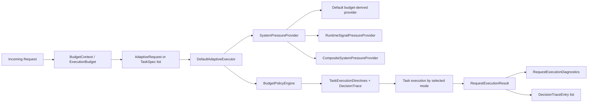
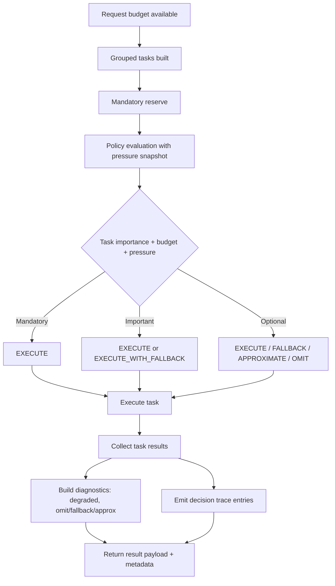

# BudgetFlow architecture

BudgetFlow is a prototype framework for **latency-budget-aware adaptive execution** in Spring Boot applications.

Its purpose is to help a request stay within a target latency budget by:
- planning related work together under a shared budget,
- classifying work by importance,
- selecting execution modes per task,
- and surfacing how the response degraded.

---

## High-level model

A request enters the system with a latency budget.

BudgetFlow then:
1. captures that budget in request context,
2. builds a request-scoped task plan,
3. evaluates the plan with a policy engine,
4. executes tasks according to selected execution modes,
5. records decision trace and diagnostics,
6. returns both business data and execution metadata.

---

## Public API layering

- **Preferred application-facing API:** `TaskKey<T>`, `AdaptiveRequest`, `AdaptiveRequestResult`
- **Core foundational contracts:** `AdaptiveExecutor`, `TaskSpec<T>`, `RequestExecutionResult`, `TaskResult<T>`, `ExecutionBudget`
- **Demo-only utilities:** dashboard comparison harness/scenarios/reporting under `com.budgetflow.demo.fintech.benchmark`

---

## Architecture diagram

---

## Core concepts

### Execution budget
An `ExecutionBudget` represents the request time budget.

It exposes:
- request start time
- total budget
- elapsed time
- remaining time
- expiration state

A default implementation (`DefaultExecutionBudget`) tracks these values using wall-clock time.

---

### Budget context
`BudgetContext` and `BudgetContextHolder` provide request-scoped access to the active execution budget.

In Spring Boot applications, the budget is established via the `@LatencyBudget` annotation and aspect-based auto-configuration.

---

### Task importance
Each unit of work is modeled with an importance level:

- `MANDATORY`
- `IMPORTANT`
- `OPTIONAL`

This classification drives how aggressively BudgetFlow is allowed to degrade a task.

---

### Task specification
A task is described with `TaskSpec<T>`.

A task spec includes:
- task name
- importance
- expected latency
- optional fallback/approximate latency hints for degraded paths
- primary supplier
- optional fallback supplier
- optional approximate supplier

This is the main input into adaptive request planning.

---

### Execution modes
The policy engine may choose one of these modes for a task:

- `EXECUTE`
- `EXECUTE_WITH_FALLBACK`
- `EXECUTE_APPROXIMATE`
- `OMIT`

These modes are recorded both in execution results and in the decision trace.

---

## Ergonomic request composition layer

BudgetFlow now includes a higher-level grouped request composition layer on top of the core execution model.

Key types include:
- `TaskKey<T>` — typed handle for a task name
- `AdaptiveRequest` — grouped request builder and execution helper
- `AdaptiveRequestResult` — typed wrapper around `RequestExecutionResult`

This layer improves application-level ergonomics by:
- reducing string-based result lookup
- making grouped request composition more readable
- preserving direct access to diagnostics and decision trace

The underlying execution model is unchanged:
- `TaskSpec<T>` still defines task behavior
- `AdaptiveExecutor` still performs grouped execution
- `RequestExecutionResult` still represents raw request outcomes

This means the ergonomics layer is additive rather than a replacement for the core model.

---

## Request-scoped planning

### Why request scope matters
BudgetFlow does not evaluate tasks purely in isolation.

Instead, related tasks are planned together under one request budget so the framework can reason about:
- mandatory work first,
- discretionary work afterward,
- and total response quality under time pressure.

### Planner behavior
The default policy engine currently uses a deterministic planning model:

1. classify tasks by importance
2. reserve budget for `MANDATORY` tasks first
3. plan `IMPORTANT` tasks from discretionary remainder
4. plan `OPTIONAL` tasks last
5. preserve original order within each importance class

This gives the planner a stable and explainable behavior model.

Key planner invariants:
- equivalent planning inputs produce equivalent directives and decision trace
- planning order is deterministic by importance class (`MANDATORY` → `IMPORTANT` → `OPTIONAL`) with stable in-class order
- reason strings are deterministic for a fixed pressure snapshot and budget context

The default policy now also emits deterministic reason strings that include:
- pressure band
- dominant pressure source
- budget band
- latency ratio at planning time

For optional work, the planner uses a deterministic degradation ladder under stress:
- prefer approximate execution when supported
- otherwise prefer fallback when supported
- omit primarily under severe budget/pressure or extreme latency-ratio conditions

The latest planner pass keeps this ladder deterministic while adding dynamic latency-ratio thresholds based on pressure/budget bands, so moderate pressure no longer forces blanket degradation for very low-latency discretionary tasks.

When a task supplies explicit fallback/approximate latency hints, the planner now also carries those reduced costs forward into rolling request-budget allocation and decision trace.

That keeps degradation decisions explainable without introducing opaque heuristics.

### Path-aware before/after mental model
- Before path-aware planning, task budgeting effectively tracked primary-path latency.
- With path-aware planning, budgeting tracks selected-path latency (`plannedExecutionLatency`) so a 10 ms fallback can free budget that was previously reserved for a 90 ms primary path.
- This is why fallback/approximate choices now affect downstream planning decisions, not just execution behavior.

---

## Decision flow diagram

---

## Policy evaluation

### Inputs
`PolicyEvaluationInput` currently includes:
- remaining request budget
- request task descriptors
- a `SystemPressureSnapshot`

### Pressure source
Pressure is provided through a pluggable `SystemPressureProvider`.

This separates:
- **request budget** from
- **system/runtime pressure**

A default provider exists, but the abstraction is designed so future implementations can use richer runtime signals.

### Output
The policy engine returns `PolicyDecision`, which contains:
- task directives
- degraded flag
- degradation reasons
- decision trace entries

### Extensibility boundary
`DefaultBudgetPolicyEngine` keeps the main planning flow deterministic, while exposing a lightweight optional-task mode extension point:
- `PlannerPolicyProfile` provides built-in deterministic variants:
  - `balanced` (default)
  - `continuity` (degraded-path-first)
  - `efficiency` (earlier optional omission under stress)
- `OptionalTaskModeSelector` chooses optional-task execution mode (`EXECUTE`, `EXECUTE_WITH_FALLBACK`, `EXECUTE_APPROXIMATE`, `OMIT`)
- `DefaultOptionalTaskModeSelector` preserves the current default ladder and stress behavior

This keeps extension localized to policy variation without introducing a heavyweight plugin system.

---

## Execution

`AdaptiveExecutor` is the core execution interface.

The main request-scoped path is:

- `executeRequest(List<TaskSpec<?>>)`

The ergonomic layer adds:
- grouped request construction with `AdaptiveRequest`
- typed result retrieval through `AdaptiveRequestResult`

Execution ultimately produces request-scoped outcomes that include:
- per-task results
- decision trace
- request diagnostics

Each task result captures the selected execution mode and whether the task was omitted.

---

## Decision trace

The decision trace is intended to explain planning behavior at request scope.

Each `DecisionTraceEntry` includes:
- task name
- task importance
- selected execution mode
- reason
- expected latency
- planned execution latency for the selected path
- allocated budget
- remaining budget at planning time

This makes the planner behavior inspectable and easier to debug.

---

## Request diagnostics

`RequestExecutionDiagnostics` summarizes the request outcome in a compact form.

It includes:
- total request budget
- remaining request budget
- degraded status
- omitted task names
- fallback task names
- approximated task names

This is the main request-level observability summary.

For the demo harness, these diagnostics are paired with grouped scenario reporting and optional JSON output so a reader can compare naïve and adaptive behavior side-by-side. This reporting remains intentionally lightweight and should be treated as a prototype demonstration aid rather than a rigorous benchmark/reporting stack.

---

## Spring Boot integration

BudgetFlow’s Spring integration currently includes:

- `@LatencyBudget`
- request budget aspect
- auto-configuration
- starter dependency
- optional `RuntimePressureSignals` adapter bean support
- optional planner profile selection via `budgetflow.planner.policy-profile`
- auto-wiring of optional `ExecutionLifecycleListener` beans into the default executor

This allows applications to establish a request budget declaratively and use the adaptive executor inside normal Spring services.

---

## Demo architecture

The demo application models a fintech dashboard request with these tasks:

### Mandatory
- balance
- transactions

### Important
- rewards

### Optional
- offers
- insights

The request is planned as a group, executed under the active budget, and returned with:
- business payload
- decision trace
- diagnostics
- concise execution summary

The demo now also uses the ergonomic grouped request API so the example application reflects the preferred application-facing usage style.

---

## Comparison harness

The fintech demo includes a lightweight comparison harness that runs the same dashboard workload with two strategies:

- `naive_parallel`
- `budgetflow_adaptive`

The harness exists to make the framework’s behavior easier to inspect locally. It is not intended to be a statistically rigorous benchmark system.

Its purpose is to show:
- how request-scoped planning changes task execution
- how constrained budgets affect response composition
- how pressure and task importance influence omission, fallback, and approximation
- how diagnostics and decision trace make degraded execution explainable

The comparison harness reuses the same dashboard workload definitions as the main demo service so that comparison scenarios remain aligned with the actual example workload.

---

## Current limitations

BudgetFlow is still an early prototype.

Current limitations include:
- heuristic planner thresholds
- limited runtime pressure realism
- no production-grade observability integration
- lightweight optional lifecycle hooks only (no full telemetry pipeline)
- low-level developer ergonomics in some APIs beyond the new grouped request helpers
- no advanced scheduling/concurrency orchestration yet
- comparison harness is scenario-driven, not a rigorous benchmark suite

---

## Near-term evolution

The most important next steps are likely:
- improve pressure-provider realism
- refine public developer ergonomics
- expand comparison scenarios and realism
- add richer architectural documentation and examples

---

## Summary

BudgetFlow’s architecture is centered on a simple idea:

> treat latency budgets as a planning input, not just a timeout

Everything else in the system follows from that:
- task classification
- request-scoped planning
- adaptive execution modes
- decision trace
- execution diagnostics
- pressure-aware policy evaluation
- higher-level grouped request composition
